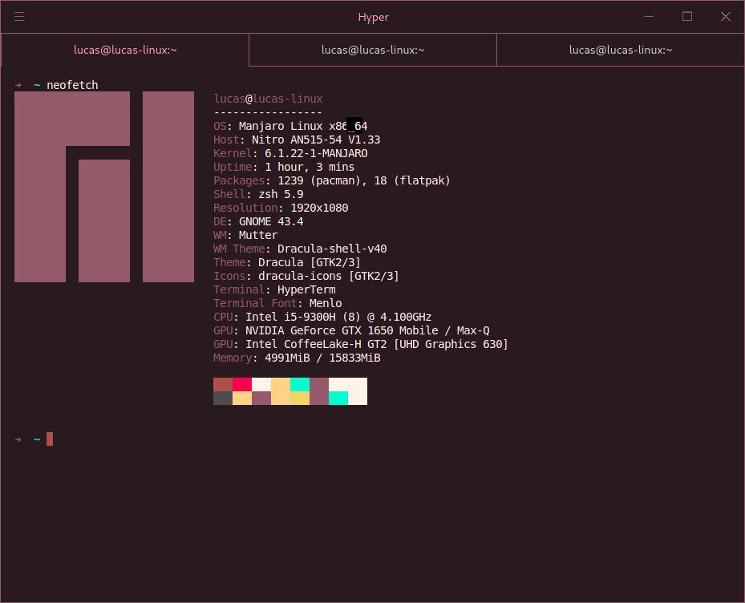

<h1 align="center">
   
  
   
  Ballerini Theme for <a href="https://hyper.is/">Hyper™</a>
   
</h1>

  <strong>Dark Brown theme for <a href="https://hyper.is/">Hyper™</a></strong>

  

  

  <a href="#install">Install</a> •
  <a href="#team">Team</a> •
  <a href="#license">License</a>

  

## Install

All instructions can be found at [INSTALL.md](./INSTALL.md).

## Team

This theme is maintained by the following people/person and bunch of [awesome contributors](https://github.com/llofyy/hyper-ballerini-theme/graphs/contributors).

|  |
| ------------------------------------------------------------------------------------ |
| [LLOFYY](https://github.com/llofyy)                                                  |

## License

[MIT License](./LICENSE)
